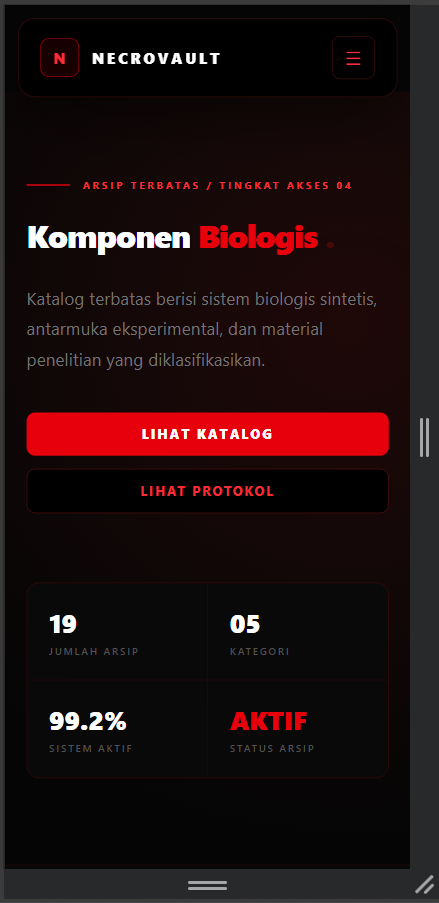
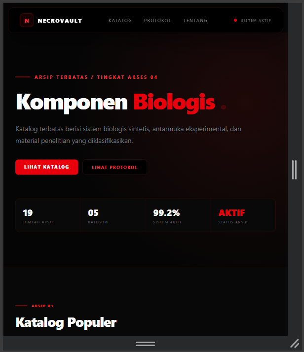
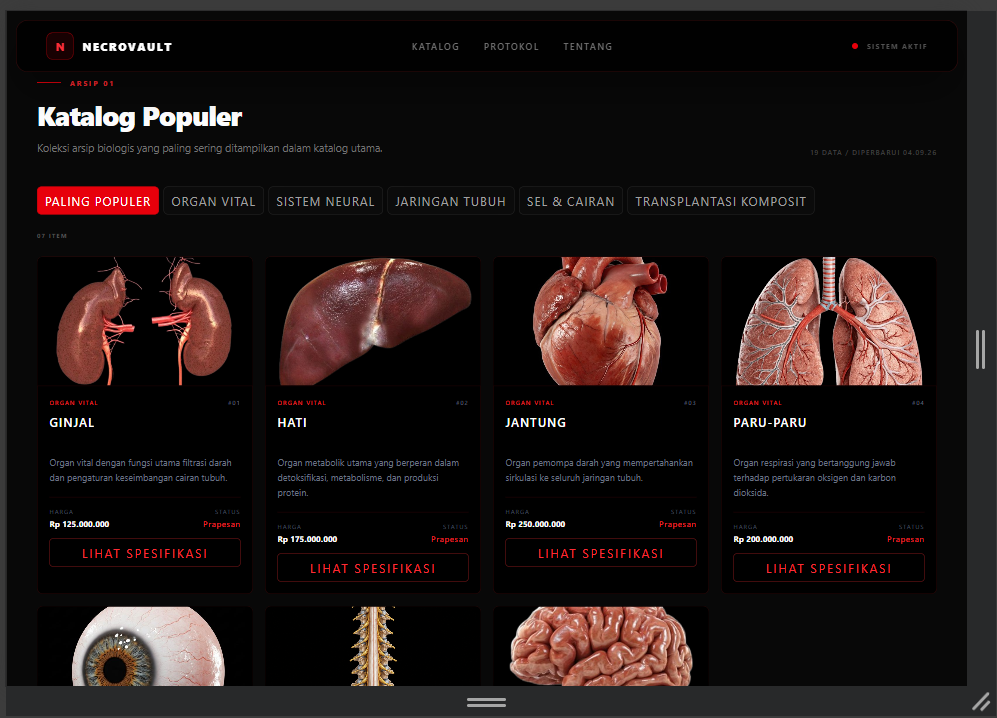

# TugasWeb-Pertemuan3-Katalog

## Tugas Rutin 3 — Katalog Produk Responsif

Website katalog produk responsif yang dibuat untuk memenuhi tugas **Katalog Produk Responsif** pada mata kuliah **Ilmu Komputer**.

### Identitas

- **Nama:** Fatih Taqiyyuddin
- **NIM:** 4253250057
- **Kelas:** PSIK 25B
- **Mata Kuliah:** Ilmu Komputer

## Deskripsi

**NECROVAULT** adalah website katalog bertema teknologi biologis dengan desain antarmuka gelap. Website ini dibuat sebagai proyek pembelajaran web dan seluruh produk, harga, serta transaksi di dalamnya merupakan simulasi fiktif.

## Teknologi

- HTML
- JavaScript
- Tailwind CSS
- Vite

## Fitur

- Katalog produk responsif
- Filter berdasarkan kategori
- Tampilan card produk
- Detail spesifikasi produk
- Sistem prapesan simulasi
- Perhitungan harga dan diskon berdasarkan jumlah
- Estimasi waktu pemrosesan
- Simulasi metode pembayaran
- Halaman konfirmasi transaksi
- Navbar responsif dengan hamburger menu pada perangkat mobile
- Access warning sebelum masuk ke katalog
- Footer

## Responsive Design

Website menggunakan pendekatan **mobile-first** dengan breakpoint responsif Tailwind CSS.

| Breakpoint | Ukuran Pengujian | Tampilan |
|---|---:|---|
| Mobile | 375 px | 1 kolom |
| Tablet | 768 px | 2 kolom |
| Desktop | 1280 px | 4 kolom |

## Dokumentasi Testing

### 1. Mobile — 375 px



Pengujian dilakukan pada viewport **375 × 800 px** untuk memastikan layout tetap nyaman digunakan pada perangkat mobile.

### 2. Tablet — 768 px



Pengujian dilakukan pada viewport **768 × 900 px** untuk memastikan perubahan layout pada ukuran tablet.

### 3. Desktop — 1280 px



Pengujian dilakukan pada viewport **1280 × 900 px** untuk memastikan katalog dan elemen halaman tampil dengan baik pada layar desktop.

## Struktur Proyek

```text
TugasWeb-Pertemuan3-Katalog/
├── index.html
├── package.json
├── README.md
├── src/
│   ├── components/
│   │   ├── accessWarning.js
│   │   ├── catalog.js
│   │   ├── mobileMenu.js
│   │   └── modal.js
│   ├── data/
│   │   ├── filters.js
│   │   └── products.js
│   ├── modules/
│   │   ├── payment.js
│   │   ├── preorder.js
│   │   └── success.js
│   ├── utils/
│   │   └── formatPrice.js
│   ├── main.js
│   └── style.css
└── screenshots/
    ├── mobile.png
    ├── tablet.png
    └── desktop.png
```

## Menjalankan Project

Install dependency:

```bash
npm install
```

Jalankan server development:

```bash
npm run dev
```

Kemudian buka alamat localhost yang diberikan oleh Vite pada browser.

## Repository

Nama repository:

`TugasWeb-Pertemuan3-Katalog`

Repository dibuat **public** untuk kebutuhan pengumpulan tugas.

## Catatan

Website ini merupakan proyek pembelajaran. Produk, harga, transaksi, dan data katalog yang ditampilkan bersifat fiktif dan tidak merepresentasikan layanan atau transaksi nyata.
